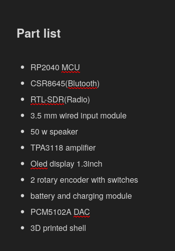
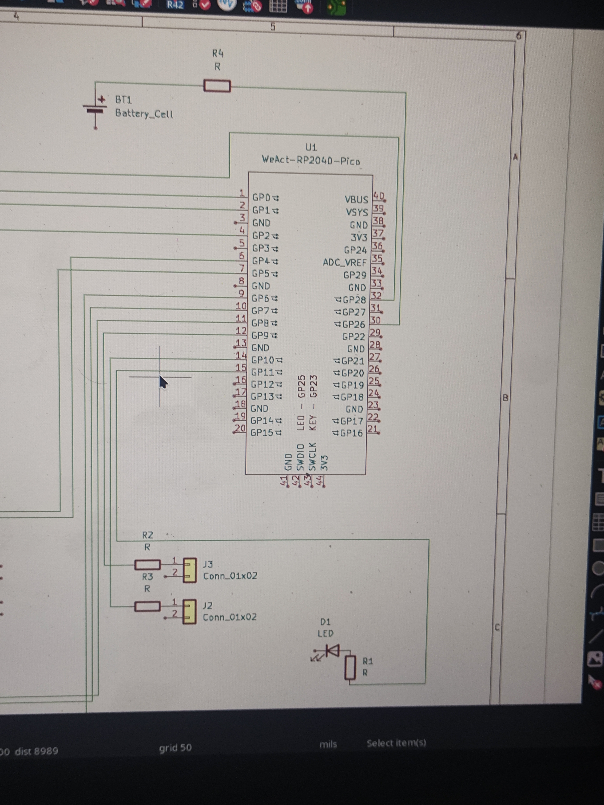
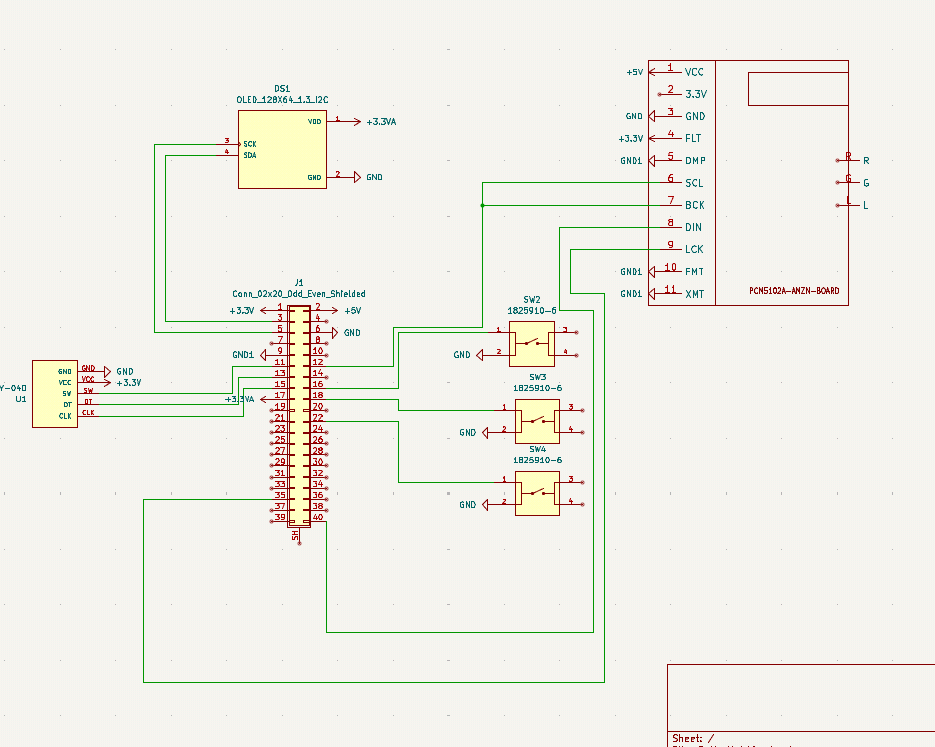
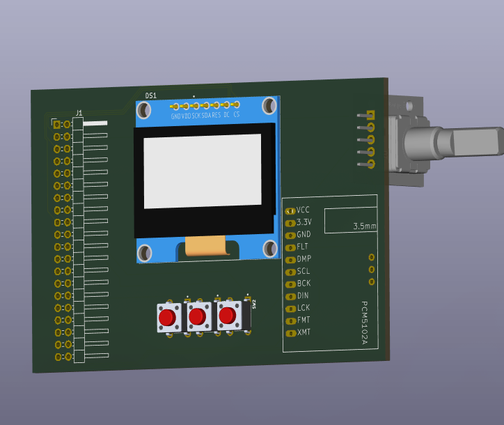
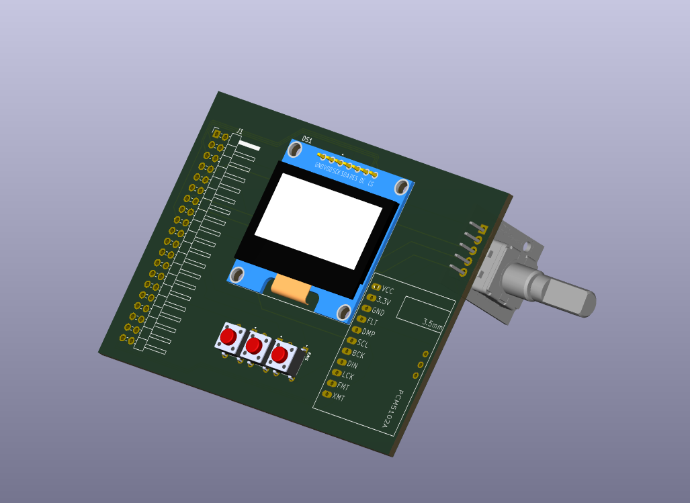
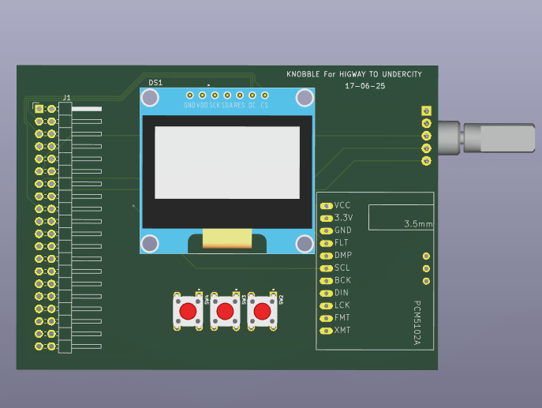

**June 12**

- Finalized the idea.
- Created Repo, and tried to add the repo in submission.yml but failed, i guess it is because i did'nt had journal.md .
- I will first complete the research for parts, then i will start building the PCB. 
- Finalized the Features and the Parts, Next step is working on PCB.

- Learning more CAD
- Can't find Symbols and Footprints for the blutooth module.
- Changed some plan and removed RTL-SDR and radio option for V1.
- Tired can't find all the footprints, it will be more complex creating whole footprint...
- Finally fixed and almost completed schematics
- Well it is 13 now technically but I haven't slept so for me it is still same.
- already started working on the CAD, completed bottom portion paused the pcb part because I got bored doing that, well currently I'm not doing anything just went to bed and writing this journal on phone, I'll add the image of the bottom tomorrow, byee:)

**June 13**
- Almost completed the CAD part I have to again focus on building the PCB dunno why it is making me super bored... and here's the pictures...

- Pausing the project for some time... 

-----
# New Journal type sh

**JUNE17**
- ALRIGHT so this will be my final project for highway, and at last I have finalized what this project will be doing, a rtl sdr and rpi based radio, which will not only play conventional fm radio but it can also listen airplanes, emergency radios and other amateur radios, there will be 4 buttons with an oled display and rotary encoder which will be the front end of this project why rpi like no zero, my plan is improving it to become a radiodeck for pentesting and ham radio so it is better to choose a good long term component and rtl sdr is the right and only choice for this project in budget
- first I will start by schematics ofc I will make one pcb for the all the components except sdr and rpi and those will fit like a hat and the 3d case for enclosure
- even tho I haven't gotten approval in any of the other two projects of mine I'll try once more to build something ngl I'm feeling a bit hopeless now going to undercity
- Peak Session of total time 6-7 hrs Completed the whole MVP feature list, now i know exactly what to build..
- Completed Schematics Gave it a PI hat type look which will be the future update in this project adding it like a pihat, anyways i also completed the PCB design and also added 3D components in the footprint for better visuals and understanding of the the case which will be made think of it as the alpha version of pcb is ready.

- I wanted to add the dac below the Oled display but it wasn't possible, but i like this arrangements too rotary encoder is on right place where i wanted it to be 3.5 mm jack too as my plan is too add no external speaker only 3.5mm jack but now because there pins on that side only for speaker, i'm thinking of making a opening for speaker if anyone is interested in doing that but currently it is better without that ways as i have to make it as cheap as possible and rtl sdr and rpi alone will cover the entire budget, i will only ask hackclub to pay for 3 components other than that i will pay for the rest..
- Here are some images of the pcb with components in 3d :

- Now the next thing is finalizing the port openings for rtl sdr as the body will be in the case itself i will use a SMA extension to give the antenna port acess from the case, also for the proper placement of rpi and also i have to start working on the coding part of this project which alone will take good amount of time ah final project, still my other two projects are still not got approved lol, i hope they get approved fast...

 
