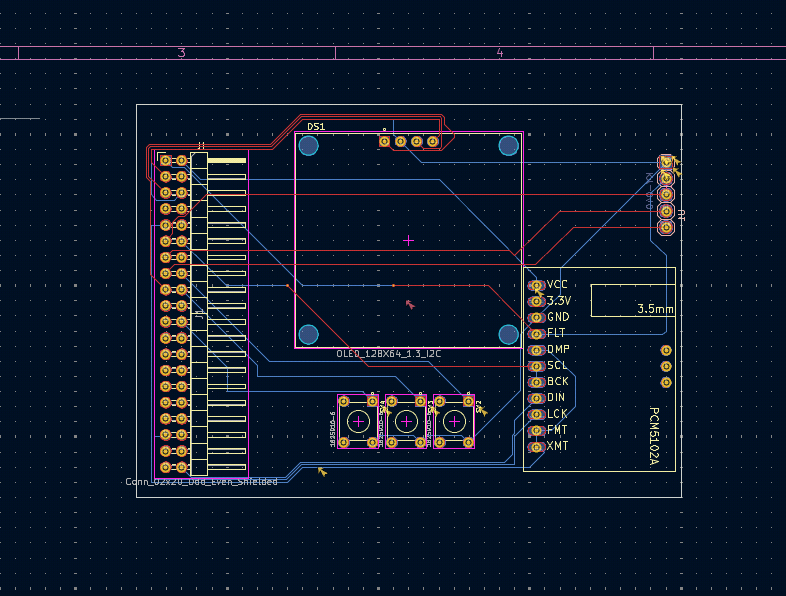
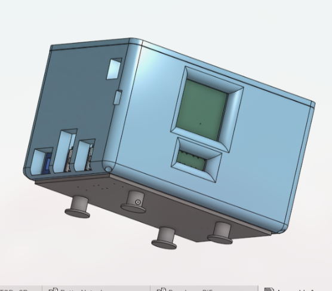
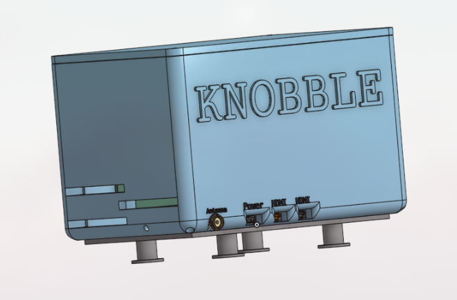
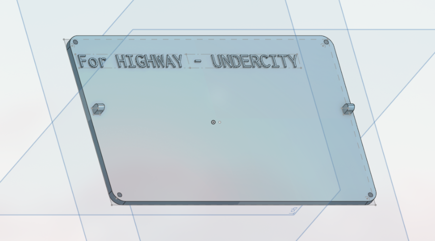
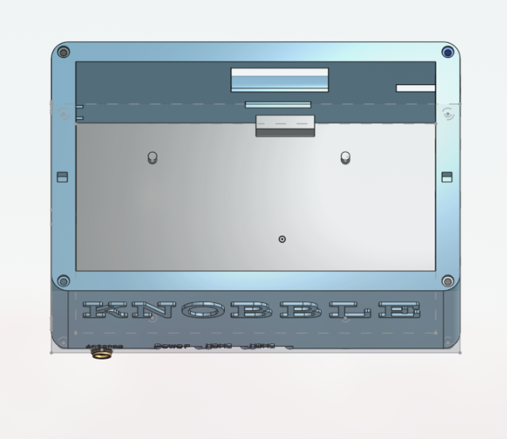
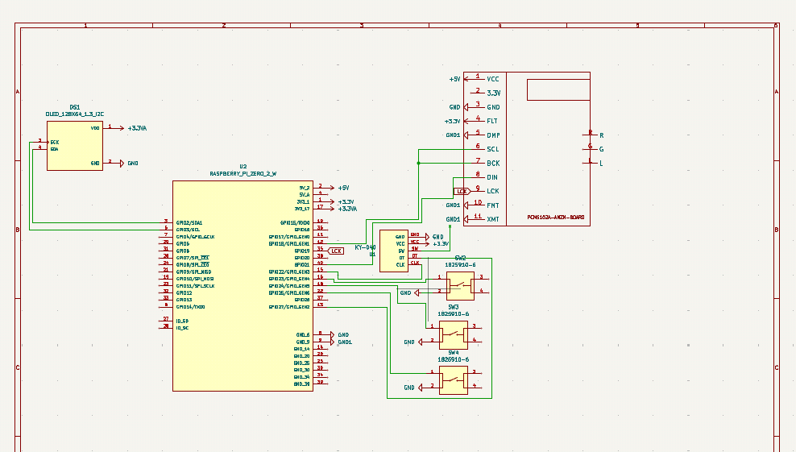
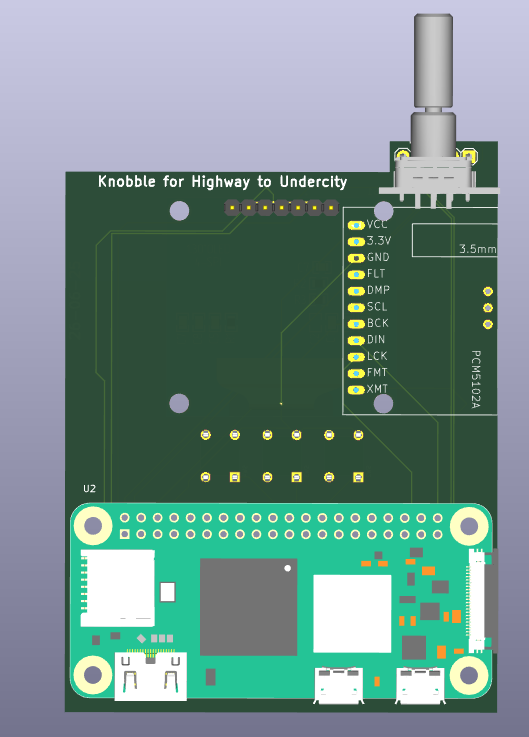
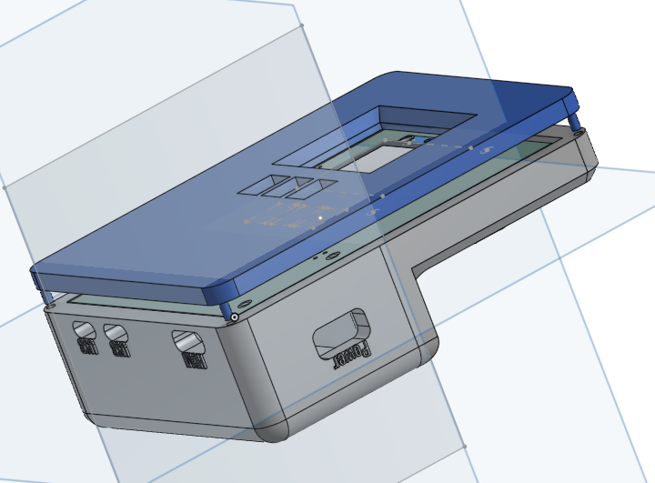
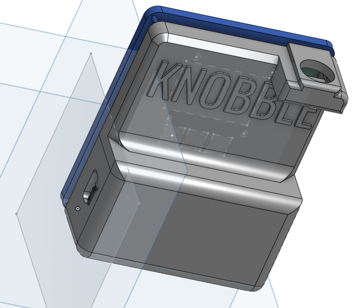

**June 12**

- Finalized the idea.
- Created Repo, and tried to add the repo in submission.yml but failed, i guess it is because i did'nt had journal.md .
- I will first complete the research for parts, then i will start building the PCB. 
- Finalized the Features and the Parts, Next step is working on PCB.

- Learning more CAD
- Can't find Symbols and Footprints for the blutooth module.
- Changed some plan and removed RTL-SDR and radio option for V1.
- Tired can't find all the footprints, it will be more complex creating whole footprint...
- Finally fixed and almost completed schematics
- Well it is 13 now technically but I haven't slept so for me it is still same.
- already started working on the CAD, completed bottom portion paused the pcb part because I got bored doing that, well currently I'm not doing anything just went to bed and writing this journal on phone, I'll add the image of the bottom tomorrow, byee:)

---

**June 13**
- Almost completed the CAD part I have to again focus on building the PCB dunno why it is making me super bored... and here's the pictures...

- Pausing the project for some time... 

-----

# New Journal type sh

---

**JUNE17**
- ALRIGHT so this will be my final project for highway, and at last I have finalized what this project will be doing, a rtl sdr and rpi based radio, which will not only play conventional fm radio but it can also listen airplanes, emergency radios and other amateur radios, there will be 4 buttons with an oled display and rotary encoder which will be the front end of this project why rpi like no zero, my plan is improving it to become a radiodeck for pentesting and ham radio so it is better to choose a good long term component and rtl sdr is the right and only choice for this project in budget
- first I will start by schematics ofc I will make one pcb for the all the components except sdr and rpi and those will fit like a hat and the 3d case for enclosure
- even tho I haven't gotten approval in any of the other two projects of mine I'll try once more to build something ngl I'm feeling a bit hopeless now going to undercity
- Peak Session of total time 6-7 hrs Completed the whole MVP feature list, now i know exactly what to build..
- Completed Schematics Gave it a PI hat type look which will be the future update in this project adding it like a pihat, anyways i also completed the PCB design and also added 3D components in the footprint for better visuals and understanding of the the case which will be made think of it as the alpha version of pcb is ready.

- I wanted to add the dac below the Oled display but it wasn't possible, but i like this arrangements too rotary encoder is on right place where i wanted it to be 3.5 mm jack too as my plan is too add no external speaker only 3.5mm jack but now because there pins on that side only for speaker, i'm thinking of making a opening for speaker if anyone is interested in doing that but currently it is better without that ways as i have to make it as cheap as possible and rtl sdr and rpi alone will cover the entire budget, i will only ask hackclub to pay for 3 components other than that i will pay for the rest..
- Here are some images of the pcb with components in 3d :

- Now the next thing is finalizing the port openings for rtl sdr as the body will be in the case itself i will use a SMA extension to give the antenna port acess from the case, also for the proper placement of rpi and also i have to start working on the coding part of this project which alone will take good amount of time ah final project, still my other two projects are still not got approved lol, i hope they get approved fast...

---

 **JUNE18**
- Alight created something ofc there is still a lot to work but now i think i'm getting how the design will be so as, on the next session i will the the lenth of the base as i need RTL SDR to get fit in this i will now remove the front side from the base and make it as another part i will make no screw required body there will be three parts base front side and top side i also have to make holes for the ports, things are going great i think building some 3d project before this really made me comfortable not like pro but i'm not scared building this designs..
- Here are some images of Pre Raw ALpha Alpha version of the cad design :

- Updated more removed the front end, from the base design i will make it as a new part i have added holes so that all the parts connect properly even tho i'm thinking of adding some screws i will make it with pin hole fit can't add clip fit  in this right now i also extruded all the port holes also added SMA port for the extension part, hehe just another idea i will only add screws on top cap cad which will hold all 3 parts of the device..

**Total Time: 8+Hrs**

- Added more changes in the cad design i still have to do more changes and make the top part, i also remove the front end individual part as it was making it more complex without any actual need created the window for display and buttons, added port hole for rotary encoder and 3.5 mm dac, i also found the base for my software like that would be the core of my core it will act as a HAL for the system, let's see how this goes and my other projects are not approved it is looking like i'm wasting my time now....

---

**JUNE19**

- Did a crazy good session of cad, almost created the complete case just need to do somemore pitchpatch i will add some images below, improved the ports design added the name on important and confusing ports added cooling vents for when the rasberry pi cooler works added screw holes properly for M3, added big ah name of the project in the back i also created the top part which is just a plate as i'm thinking of making that plate in acrylic like teeansparent which will look good i added event name in that added foot stand below which also improved the looks of the design i'm still not best in cad but it is looking pretty good to me, i now have start working on the code and improving the cad even more, i also the the power button solution as it was in the box i remebered i something like this in past, i created a tunnel leading to the button now i just need a small iron rod like needle type not sharp ofc and button cap that's it and it will work great fs, added the ports of 3.5 and rotary encoder i also added the snap and fit which i was talking about on the cap i also added screws for safety, the only untouched thing is now the coding part which i have to lock in for other than that here are good amount of pictures i will also use them in the readme file but i still can't add pcb with components and combine them my laptop is not for this kind of stuff but is still handeling pretty well anyways end of yapping here are the images :

And here are images of the current final final cad:

- that's it for this session i spend around 3-4 hrs in this i know it's way too much but i'm not the best in cad and my laptop LAGS....

---

**JUNE20**

- did more polish to the base removed fillet from some parts and added chafer their it looks more better that way, this will be final v1 also thought of removing the fillet from the pins but i didn't because it won't change anything, fixed the SMA antenna porti didn't know the extrude length is less so fixed that part, i also improved the stand added discs below for better grip and stability so i think the case is pretty much done, now i have to complete the code for the project i have already started working on it finalised the flow of it i will use base libs ofc i'm building with python because so it should be easy to atleast make rtl sdr work...
- Here are the images of the case v1 :

---

**JUNE22**

- complete a major portion of code, added 3 options for scanning Auto scan, Preset scan and manual scan via rotary encoder the auto scan steps thrugh rang and pauses on strong signals, the preset scan works for indian frequencies as i'm indian so i added frequencies for india, you can add different presets by changing the code.. i also added support for FM, AM and NFM becuase i'm using a beast rtl sdr and so you can also listen to airplanes radio channels which is pretty exciting and audio will be first yeah forgot to add add ALSA for audio filtering which then will be sent to DAC and our switches should be fully functional like rotary encoder can adjust volume and frequency and if pressed it can toggle scan and mute then there are feautres of switches too, well it does basically work like a normal radio but with added advance features i also added proper shutdown like it willl save the last used state and clears the displaya and gpio, there is no point in adding what problems i had because whatever problem i had it quickly got fixed using a tool called AI lol, anyways i'm also thinking of making a installation script for installing the software on the rpi properly also and yeah my wayboard got rejected which means none of my rpoject got approved which is kind of sad as i'm investing a good amount of time in this but yeah i think that's life for me, but still the wayboard is created to be minimal and simple that's how i like things why should i add jargon like a oled display or something it is a keyboard, well still i also updated its cad a bit anyways got lost ranting my bad anyways i'll add some images for the code snapshots while i was working on the software.

- Here are some images:

---
**JUNE23**

- Completed the project design some code work left but it is working i will start working on the readme now and submit it today only because not many days are left becuase the submission line closes, i'm a bit confused about where should i put this proejct advance or 6 points? like i need just 150usd other than that i will be paying anyways so i will put in the 6 point project yeah that should work so completing the readme, adding all the files and also i created the installation scipt it will take a bit more time to work perfectly iand i was getting a but too tired working on this porject so i will work on it aftersome time still it is wroking correctly as needed..
 
----
**EXTRA**

- added logo in the readme
- alright now it is ready to get submitted i will recheck everything and then submit it..

---
**JUNE28**

-SO the project got rejected the suggestion was i have to change rpi 5 to zero 2 w so i did but then it started looking a bit wierd so i redesigned the pcb and case making it a handheld radio scanner so first i started with the schematics and pcb design which took me a long time as i wasn't able to decide how i want the case to look after thinking i decided to go for a retro handheld game toy type design and started working on it after the pcb i started working on the case which took me the longest time to build, i started by importing the pcb then creating the base around it then i thought i can put the rotary encoder a bit out like it will look like a walkie-talkie so i revamped the accordingly, actually i first created the base as to rectangle but then i had to break them in two as they  will be of different so i changed the base then the alpha base was completed i then did some fillet and chafer then i started finding dimensions for ports and stuff i tried importing my pcb with components but my laptop can't handle that but i still did it and made the ports, i also added space for waveshare ups for rpi zero 2 w so i added ports for that then then base beta version was done, then i started again started doing some touch ups like size shifting, improving asthetics and i shifted to the top side which i later imported it to my part 1 i.e base to cut area for display and button then i started working for holes for screws but then i dropped the idea as i saw a video for screwless designs which are very good for making it easy to assemble so i did that basically i have to maintain enough friction that they stay in place basically focus on size so i created that and vallah it was done, thankfully rpi zero have same pinout as normal rpi so i didn't had to do any major changes but while making this i also thought of making a mp3 player which can be done so i'll work on that tooo anyways here are all the images captured while making this version:

- Images:

 

- I hope this time the project gets approved, i also have to add all the prices in the BOM so i'll do that too...

---
**JUNE29**

- fixing README after that i'll upload it to github and resbumit the project....

----
