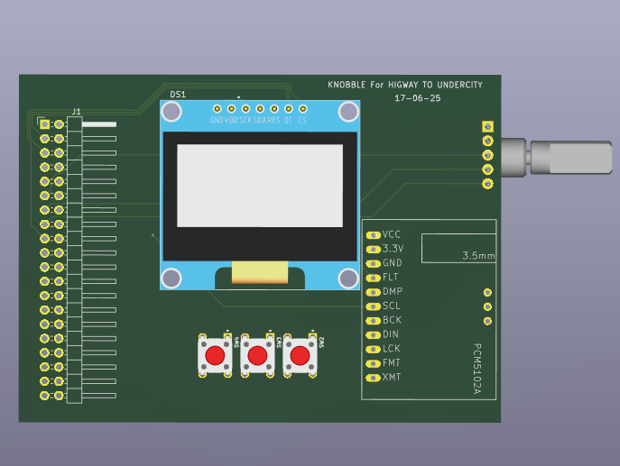

# Knobble
A modern design for not so common radios.

---

# Overview

Knobble is a Rasberry pi based Radio scanning system design for real time monitoring and interacting with different radio frequncies via an RTL-SDR dongle. It can help you to listen through FM, aviation, emergency, amateur, and public service frequencies.

---

## Features

- Runs on Rasberry PI.
- Multi-band scanning across FM, aviation, emergency, amateur, and police frequencies
- Preset system with multiple frequency banks and persistent storage.
- Automatic and manual scan modes
- Better shutdown process
- Oled Display for sharing all the relevant live info.
- and a cool CAD Design for emotional support lol.

---

## Controls

| Control                   | Action                                         |
| ------------------------- | ---------------------------------------------- |
| **Rotate Encoder**        | Adjust volume or frequency                     |
| **Encoder Button (tap)**  | Start/stop scanning                            |
| **Encoder Button (hold)** | Toggle mute/unmute                             |
| **Switch 1**              | Cycle through preset banks                     |
| **Switch 2**              | Toggle scan mode (Manual / Auto / Preset)      |
| **Switch 3**              | Change radio service type (FM, Aviation, etc.) |

---

## Files to build 

### PCB 

The files for the PCB and Schematics are available in the PCB folder and gerber files are added in the Production folder..

### 3D Case (CAD)

The step files for the keyboard are available in the CAD folder and also in the Production Folder.

**BASE**

**TOP**

---

## Combined Images

Can't add a combine image of pcb with components my laptop can't handle all that together..
Other than this you just have to purchase the Components given in the BOM and solder and assemble them.

---

## BOM 

| Component                     | Quantity | Note                                                                                                                              | Price  | Link                                                                                                                                                                                                                                                                                                                                                                                                                                                                                                                                                                                                |
| ----------------------------- | -------- | --------------------------------------------------------------------------------------------------------------------------------- | ------ | --------------------------------------------------------------------------------------------------------------------------------------------------------------------------------------------------------------------------------------------------------------------------------------------------------------------------------------------------------------------------------------------------------------------------------------------------------------------------------------------------------------------------------------------------------------------------------------------------- |
| Rasberry pi 5 (4-8gb variant) | 1        | I'm using rasberry pi because my plan is to expand this device for transmitting and making it a fully fledged rf pentesting tool. | 80USD  | [Available](https://www.amazon.in/Raspberry-Pi-Cortex-A76-Computer-RPI5-4GB-SINGLE/dp/B0CK3L9WD3/ref=sr_1_3?crid=1AK40TAY93FVZ&dib=eyJ2IjoiMSJ9.7GkeqpiPME_MaXJm-8abaYARAa9Staaf3G6BpTO7XNh8L7LWMqQiTSMZkRn6rMGalgTKNC8CmE2Ctz805lWJKJpXABBAJwev2pmTDL3T5CftWGIfDYLJnVp8lWb5S0iy_EvU0e2i9I_8n7q5Neype5SEofN9hdVXzUaAwCWH4__5iwVyKWNv5rxcaKw1xTN9YMhdWAVYlzmA9nJdEDaOvfnXgwawK5yAkzbfjPfggkU.Ax5HfAbNxLGqgjOn7U8XXQwX7r8QmKMs_q7rTe61u5Y&dib_tag=se&keywords=raspberry+pi+5+4gb&qid=1750676006&sprefix=raspberry+pi+5+4g%2Caps%2C260&sr=8-3)                                                         |
| RTL-SDR                       | 1        | most important for the project..                                                                                                  | 100USD | [Available](https://www.amazon.in/RTL-SDR-Blog-RTL2832U-Software-Defined/dp/B0BMKB3L47/ref=sr_1_1?crid=2C4S56L9CX1PE&dib=eyJ2IjoiMSJ9.vrn9A9hDsZHi4yjiG1trvMSzRxhD_uuHzN71yWss9l2EVpnytfdPnEXIFwrcJny1zmIVRvVtUhvyFSNoKzb1yxvalLyXDdiWkBQ2mTpkRoGzZ8Wxfuws8atBsW0tqKdTWJLxWOH_3GTho19gBUIO2VA6lKkbIaj3Ku8zpIpwZpF8VNhKeOxoXxwSxb_noDZlUUlfGjUrU1NDshFX7szdt0jhTyVoRQMHA8dSC9aHpHA.SLgATrtzhXpCY7_MnmqfAaUYf6Fbipp4gkf_yB0s9AU&dib_tag=se&keywords=RTL+SDR&qid=1750676059&sprefix=rtl+sd%2Caps%2C248&sr=8-1)                                                                                         |
| 1.3 inch oled display         | 1        | It has 2 extra Stabilizers just in case..                                                                                         | -      | [Available](https://www.amazon.in/OLED-Display-display-module-Blue/dp/B094W7TDKG/ref=sr_1_2?crid=3Q8FJIB11QGHE&dib=eyJ2IjoiMSJ9.B7UJuX2tN4RE5qUC46uLygug8WxLWjSOgkyJMu7-EXH34VlmGjoBuWPJP22TIlHrdvHc4LjgYXnp2hc3py_BE1EeIB7uhaHjrsFRpNXUNRdJJqR5dObtouw747pxiRkK7KSuLolsob9jHVAnGcaUQn5teiI1JISdhIaT3GLy4wLR4472yi4Cjp-WcG2tbnTWI6ai3V6rmwGP0F4cLP8XCu0CnJj878OKKMi18kqWd-w.z5miULqVkwuwROpuzjmyTGVz6pdf8Er0rOkTBH4zD-s&dib_tag=se&keywords=1%2C3+inch+oled+display&qid=1750676109&sprefix=1%2C3+inch+oled+displa%2Caps%2C227&sr=8-2)                                                               |
| macro switches                | 3        | user input                                                                                                                        | -      | [Available](https://www.amazon.in/ElectroBot-Momentary-Tactile-Push-Button/dp/B07PRRRBRY/ref=sr_1_1?crid=3A13O9GTZCJTT&dib=eyJ2IjoiMSJ9.ywZ6IJGz3wBwO5yx6JNpWU7bTNqhmG7V93EB-IZ-JDN9dq84HvncJGBKdq3szFXO7DjgEjtNHZZev_grtvow-EBgi9dbSdYb4x6gZz8frklBiRoYwr-HtvkC6vMB6OoucfVIfdCdwJNJl1YVmI-jnSBV9ggpTkX4rCflhf3Db0rXnLsw60gGAFM_zpkKHshmSplU8bJQTrlUSEH9eFQMwmh5EH5girDi91LfAx-8Y2GuOzoSNRSMNUPfkPEWzjJIPfmlXxrFK_xB74uM5Kiq-DCyVl3-jWP0sqg_Z1g6r8w.yTcfCG3KPUlAqFMJ61EKJjHU4YNpSfgYGlwQA2kAg7Y&dib_tag=se&keywords=micro+switches+6mm&qid=1750676178&sprefix=micro+switches+6m%2Caps%2C248&sr=8-1) |
| Rotary encoder                | 1        | User input                                                                                                                        | -      |                                                                                                                                                                                                                                                                                                                                                                                                                                                                                                                                                                                                     |
| PCM5102A DAC                  | 1        | For connecting external speaker, headphones, etc                                                                                  | -      | [Available](https://www.amazon.in/Interface-PCM5102-GY-PCM5102-Raspberry-PCM5102A/dp/B09PQHF16R/ref=sr_1_15?crid=1YX0XLBW8ZWNY&dib=eyJ2IjoiMSJ9.EWPfhJKcFHj2R-p3EVgfT5D-X4oLMYXwM_-vLGUpudKmRxYhwqX6aey8gtBNKkdAASQXu844Iid9WBTx2lBA1bv2xYkz6fwBt1dFvYdE6sG2CosxdD51Dh3MLEPffGDe_dWBAe4P_IBAJ5cuVufmeh-5bzf4qLRX0lOZ946L-Gtuiw0_-sMcYxu8FnViPLlfxAfLU6uOJZu9CnTm91o8r2BLsORIEDJdYd27YArhVaM.QF9wxeDbKYqty_NRyJtPCp8eS58gyRWdlPHmyjNJB0s&dib_tag=se&keywords=pcm5102+dac&qid=1750676267&sprefix=PCM5%2Caps%2C239&sr=8-15)                                                                            |
| PCB                           | **       | JLCPCB ftw                                                                                                                        | -      |                                                                                                                                                                                                                                                                                                                                                                                                                                                                                                                                                                                                     |
| CAD                           | **       | Legion ftw                                                                                                                        | -      |                                                                                                                                                                                                                                                                                                                                                                                                                                                                                                                                                                                                     |
| 180Deg USB adapter            | 1        | for connecting rtl sdr                                                                                                            | -      |                                                                                                                                                                                                                                                                                                                                                                                                                                                                                                                                                                                                     |
| Total                         |          |                                                                                                                                   | 180USD |                                                                                                                                                                                                                                                                                                                                                                                                                                                                                                                                                                                                     |
|                               |          |                                                                                                                                   |        |                                                                                                                                                                                                                                                                                                                                                                                                                                                                                                                                                                                                     |

**I already know it going above 150USD so i'm ready to pay the remaining cost as i already paying for different parts**

---

## Extra Stuff

### Gratitude
- Thanks to Hackclub and Hackpad for making me do this brilliant project, More coming :).
- Thanks to my potato for helping me till the end.
- Thanks to myself for completing the project and not getting distracted with another project.
- And Thank you for Reading?

### Inspiration
**Going to Undercity!!** and i always wanted to build thiss project becuase RF always makes me curious it is like another invisible world which we can only access through speacial gears feels Magical...

### Challanging
Building the custom case.. i don't have the words to express my pain...

---

## End
Check my [BLOG](https://mihranrazaa.pages.dev/)
~ mihranrazaa(If you are reading this please review HappyUSB too ToT )

BYEEE
